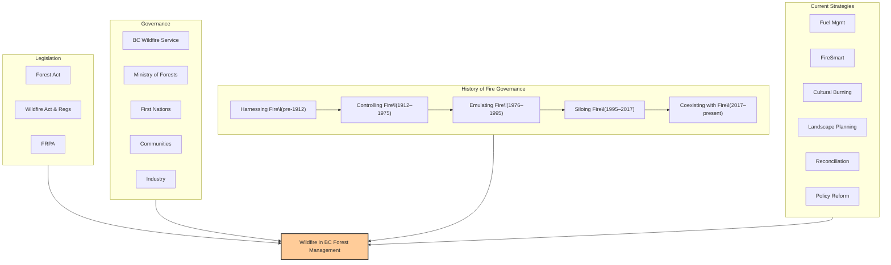

# Wildfire and Forest Management in British Columbia  

### Why it matters  
- BC has one of the most fire-prone forest landscapes in Canada.  
- Climate change, fuel buildup, and expanding wildland–urban interface (WUI) make wildfire a central issue in forest management.  
- Fire governance is shifting from “suppression only” to **coexisting with fire**.  

---

### Key Legislation & Governance  
- **Forest Act (1912; updated):** Established provincial control of forests and fire; prioritizes timber values.  
- **Wildfire Act & Regulations (2004):** Defines responsibilities for prevention, preparedness, and liability; governs BC Wildfire Service (BCWS).  
- **Forest and Range Practices Act (FRPA, 2004):** Sets rules for forest management on Crown lands. Fire is not yet a core value but reforms are underway.  
- **BC Wildfire Service (BCWS):** Leads wildfire management (prevention, preparedness, response, recovery). Organized into six regional Fire Centres.  
- **Ministry of Forests:** Responsible for forest policy and land use planning.  
- **First Nations & Communities:** Historically practiced fire stewardship; now increasingly recognized as essential partners in proactive fire governance.  

---

### Historical Shifts in Fire Governance  
1. **Harnessing Fire (pre-1912):** Indigenous fire stewardship sustained ecosystems.  
2. **Controlling Fire (1912–1975):** Colonial suppression, “fire as the enemy.”  
3. **Emulating Fire (1976–1995):** Recognition of fire’s ecological role; limited prescribed burning.  
4. **Siloing Fire (1995–2017):** Fire (BCWS) separated from forestry; catastrophic fires exposed system gaps.  
5. **Coexisting with Fire (2017–present):** Push for proactive, collaborative governance with Indigenous leadership and community engagement.  

---

### Current Priorities  
- **Fuel management:** thinning, prescribed burning, cultural burning.  
- **FireSmart:** community-level WUI risk reduction.  
- **Landscape planning:** integrating fire risk into broader forest management.  
- **Reconciliation:** advancing Indigenous fire stewardship and co-governance.  
- **Policy change:** potential FRPA/Wildfire Act reforms to embed fire risk reduction.  

---

### Further Resources  
- [About BCWS & wildfire history](https://www2.gov.bc.ca/gov/content/safety/wildfire-status/about-bcws)  
- [Forest Range and Protection Act (FRPA)](https://www2.gov.bc.ca/gov/content/environment/natural-resource-stewardship/laws-policies-standards-guidance/legislation-regulation/forest-range-practices-act)
- [Recent Changes to FRPA](https://www2.gov.bc.ca/gov/content/environment/natural-resource-stewardship/laws-policies-standards-guidance/legislation-regulation/forest-range-practices-act/frpa-improvement-initiative)  
- **FireSmart BC:** [Community preparedness](https://firesmartbc.ca/)  

---

## Infographic (Mermaid Diagram)  
f
