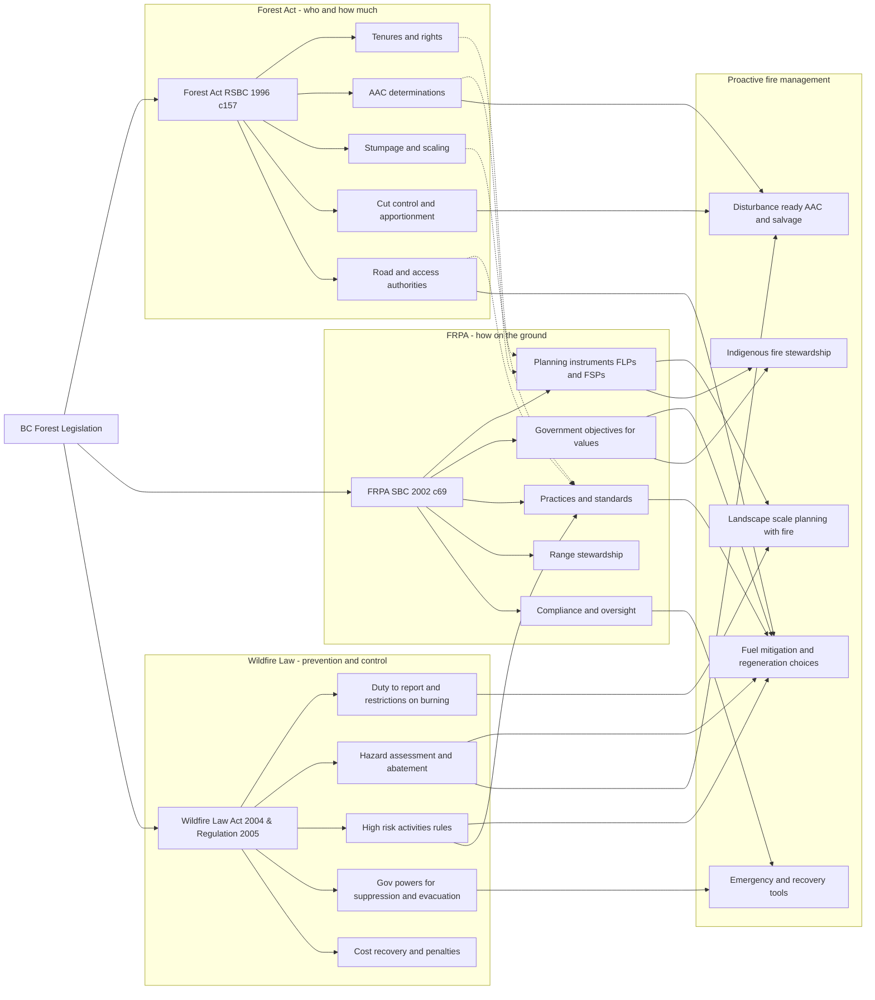

# Forest Legislation in British Columbia (summary)

This handout summarizes the **Forest Act**, the **Forest and Range Practices Act (FRPA)**, 
the **Wildfire Act and Regulation**, and how they relate to one another in guiding forest management practice in BC, 
with emphasis on linkages to **Proactive Fire Management**.

## Forest Act (RSBC 1996, c.157)

**Scope and Purpose**  
Governs **ownership, classification, and disposition of Crown timber in BC**.  Sets the rules for allocating timber rights, allowable annual cut (AAC), and stumpage revenues.

**Key Components**
- **Forest Land Designation**: Provincial forests, wilderness areas, timber supply areas.  
- **Timber Tenure System**: Forest licences, TFLs, timber sales, community forests, woodlots, First Nations woodland licences.  
- **Revenue System**: Stumpage, scaling, audits, penalties.  
- **Regulation of Harvesting**: Cut control, AAC apportionment, salvage.  
- **Infrastructure & Operations**: Road permits, forest service roads.  
- **Oversight & Enforcement**: Inspections, cancellations, appeals.  
- **Special Designations**: Special purpose areas, compensation provisions.  

**Bottom Line**  
The **"who, what, and how much" law** — *who gets to log where, under what licence, and how much they pay*.

## Forest and Range Practices Act (FRPA) (SBC 2002, c.69)

**Scope and Purpose**  
Governs **how forest and range activities are conducted**.  Establishes a results-based system where licensees must meet government objectives for values.

**Key Components**
- **Planning**: Forest Landscape Plans (new), Forest Stewardship Plans (FSPs), site-level plans.  
- **Government Objectives**: Soils, water, fish, biodiversity, wildlife, cultural heritage, recreation, range resources.  
- **Forest Practices**: Harvesting, roads, silviculture, regeneration, seed use, wildfire response.  
- **Range Practices**: Range use/stewardship plans for grazing and hay.  
- **Compliance & Enforcement**: Inspections, audits, penalties, stop-work orders.  
- **Oversight & Appeals**: Forest Practices Board, Forest Appeals Commission.  
- **Indigenous Participation**: Consultation in FLPs and FSPs; co-governance under DRIPA.  

**Bottom Line**  
The **"how" law** — *sets the rules of conduct on the ground to ensure activities meet government objectives*.

## Wildfire Law (Wildfire Act 2004 + Regulation 2005, current to 2024/2025)

**Scope and Purpose**  
Governs **wildfire prevention, preparedness, response, and recovery** across BC’s forests and grasslands.  Applies to industrial operators, landowners, and the general public.

**Key Components**
- **Duties & Restrictions**  
  - Duty to report unattended fires.  
  - Rules for open burning (campfires, Category 2–4 fires).  
  - Restrictions on industrial burning and high-risk activities.  
  - Hazard assessment and abatement obligations.  
- **Government Powers**  
  - Fire bans, restricted areas, evacuation orders.  
  - Requisition of equipment and personnel for fire control.  
  - Authority to enter private land and recover costs.  
- **Administrative Remedies**  
  - Cost recovery for fire suppression.  
  - Administrative penalties, remediation orders, stop-work orders.  
  - Appeals via Forest Appeals Commission.  
- **Offences & Penalties**  
  - Fines, employer liability, director/officer liability.  
  - Court orders for damages and remedies.  
- **Regulation Highlights**  
  - Defines **high-risk activities** (e.g., mechanical brushing, felling, welding, fireworks).  
  - Sets **precautions** (hand tools, fire watchers, water delivery systems).  
  - Fire Danger Class system governs activity restrictions.  
  - Rules for compensation and rehabilitation after fire control.  
  - Recognition of **Indigenous agreements for open burning and cultural fire use**.  

**Bottom Line**  
The **"fire law"** — *sets prevention duties, empowers government for control, regulates open burning and high-risk activities, and recovers suppression costs*.  Central to **Proactive Fire Management** by linking prevention, hazard reduction, and cultural burning to enforcement.

## How These Laws Relate

- **Forest Act** → Allocates timber rights and revenues.  
- **FRPA** → Regulates forest/range practices on the ground.  
- **Wildfire Law** → Governs wildfire prevention, suppression, and recovery.  

Together, these statutes combine:  
- **Economic rights (Forest Act)**  
- **Environmental responsibilities (FRPA)**  
- **Safety and disturbance management (Wildfire Act/Regulation)**  

Recent changes to all three sets of laws reflect a policy shift towards higher priority of **fire resilience, climate adaptation, and Indigenous stewardship**.

## Further Resources  

- [Forest Act Full Legal Document](https://www.bclaws.gov.bc.ca/civix/document/id/complete/statreg/96157_00)
- [Forest and Range Practices Act (FRPA) Full Legal Document](https://www.bclaws.gov.bc.ca/civix/document/id/complete/statreg/00_02069_01)
- [Wildfire Act Full Legal Document](https://www.bclaws.gov.bc.ca/civix/document/id/complete/statreg/04031_01)
- [Wildfire Regulation Full Legal Document](https://www.bclaws.gov.bc.ca/civix/document/id/complete/statreg/38_2005)

## Diagram: How the Acts Relate, with Fire Management Focus

The diagram below provides a visual representation of the relationship between key pieces of forest legislation in British Columbia: the Forest Act, the Forest and Range Practices Act (FRPA), and the Wildfire Law (Wildfire Act and Regulation). It illustrates how each act contributes to forest management by highlighting their respective focus areas.

- **Forest Act**: Emphasizes the economic aspects through tenures and rights, AAC determinations, and revenue systems.
- **FRPA**: Focuses on ground-level practices by setting government objectives for forest values and outlining compliance and oversight mechanisms.
- **Wildfire Law**: Centers on wildfire prevention and control by detailing duties, hazard reduction, and government powers.

Additionally, the diagram links these statutes to Proactive Fire Management efforts that integrate landscape planning, indigenous stewardship, and emergency recovery. It underscores the interconnection between economic rights, environmental responsibilities, and safety management, while highlighting recent policy shifts towards fire resilience and climate adaptation.

---

**Prepared for FRST 521 — September 2025**  
For teaching purposes only. Summarizes legislation current to August 2025.  

