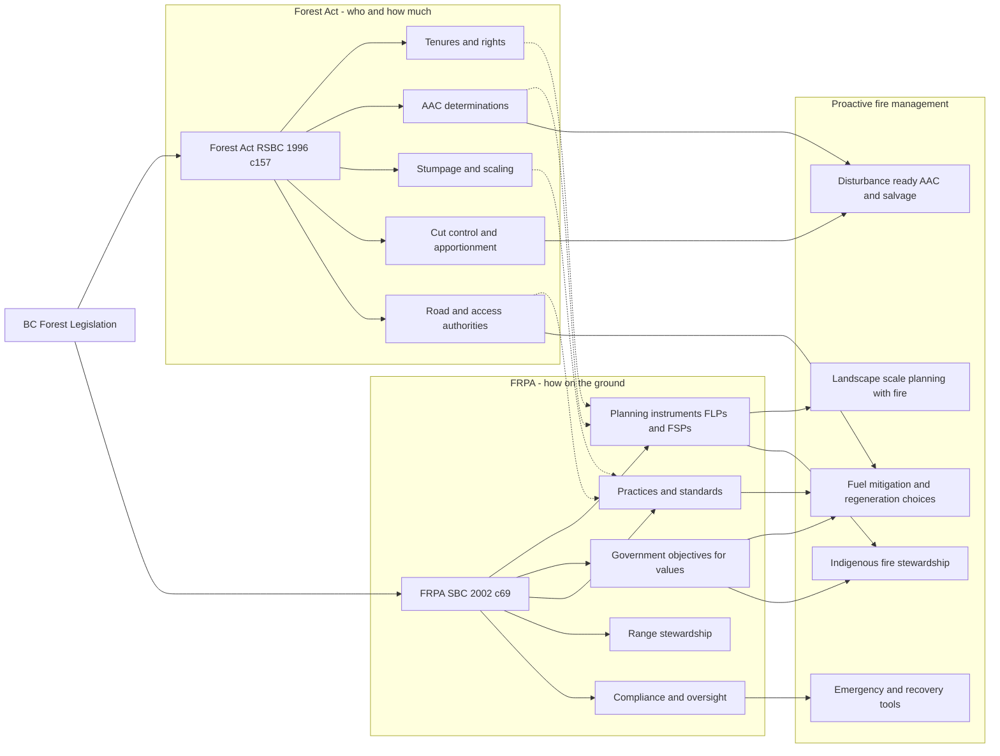

# Forest Legislation in British Columbia: Student Handouts

This set of handouts summarizes the **Forest Act**, the **Forest and Range Practices Act (FRPA)**, 
and how the two Acts relate to one another in guiding forest management practice in BC, 
with emphasis on **Proactive Fire Management**.

## 1. Forest Act (RSBC 1996, c.157)

**Scope and Purpose**  
The Forest Act governs **ownership, classification, and disposition of Crown timber in BC**.  
It sets the rules under which the province allocates timber rights, sets harvesting levels, and collects revenues.

**Key Components**
- **Forest Land Designation**: Provincial forests, wilderness areas, and timber supply areas (TSAs). Chief Forester sets AAC at least every 10 years.  
- **Timber Tenure System**: Licences include forest licences, tree farm licences, timber sale licences, woodlot licences, community forest agreements, First Nations woodland licences.  
- **Revenue System**: Stumpage (royalties) must be paid; includes scaling, audits, and penalties for non-payment.  
- **Regulation of Harvesting**: Cut control rules; AAC apportionment; salvage and adjustments for disturbances.  
- **Infrastructure & Operations**: Road permits and forest service roads.  
- **Oversight & Enforcement**: Inspections, audits, suspensions, cancellations, appeals.  
- **Special Designations**: Allows special purpose areas and compensation provisions.  

**Bottom Line for Students**  
The Forest Act is the **"who, what, and how much" law** — it governs *who gets to log where, under what licence, and how much they pay for it*.

## 2. Forest and Range Practices Act (FRPA) (SBC 2002, c.69)

**Scope and Purpose**  
FRPA governs **how forest and range activities are carried out on Crown land**.  
It sets a results-based framework where licensees must meet government objectives for values while professionals are relied on to implement practices.

**Key Components**
- **Planning Framework**: Forest Landscape Plans (new), Forest Stewardship Plans (FSPs), site-level plans, woodlot and community forest plans.  
- **Government Objectives**: Soils, water, fish, biodiversity, wildlife, cultural heritage, visuals, recreation, range resources.  
- **Forest Practices**: Roads, harvesting, silviculture, regeneration, seed use, forest health, wildfire response.  
- **Range Practices**: Range use and stewardship plans for grazing/hay.  
- **Compliance & Enforcement**: Inspections, audits, administrative penalties, stop-work orders.  
- **Oversight & Appeals**: Forest Practices Board and Forest Appeals Commission.  
- **Indigenous Participation**: Required consultation in FLPs and stewardship plans; supports co-governance under DRIPA.  

**Bottom Line for Students**  
FRPA is the **"how" law** — it governs *the practices on the ground to ensure activities meet government objectives*.  

## 3. Relationship Between the Forest Act and FRPA

**Forest Act** → *Who, where, how much* (tenure, AAC, stumpage).  
**FRPA** → *How on the ground* (plans, practices, compliance).  

Together, these Acts:  
- Define forest governance in BC, combining **economic rights** with **environmental responsibilities**.  
- Increasingly integrate **fire resilience** and **climate adaptation** into both allocation and practices.  

**Recent Impactful Changes**
- **Forest Act**: AAC determinations must account for wildfire and climate impacts; post-fire salvage apportionments; compensation for tenure holders after catastrophic fires.  
- **FRPA**: Shift to Forest Landscape Plans (FLPs) requiring wildfire considerations and Indigenous consultation; statutory objectives expanded to include *prevention, mitigation, and adaptation to wildfire*; new provisions for areas of catastrophic damage and recovery.  
- **Cross-Cutting**: Integration of DRIPA supports Indigenous fire stewardship and co-management.  

**Bottom Line for Students**  
- The **Forest Act** sets up the economic/legal foundation.  
- **FRPA** sets the rules of conduct in the forest.  
- Together, they now emphasize **Proactive Fire Management** as a central theme.  

## 4. Diagram: How the Acts Relate, with Fire Management Focus

---

**Prepared for FRST 521 — September 2025**  
For teaching purposes only. Summarizes legislation current to August 2025.  

