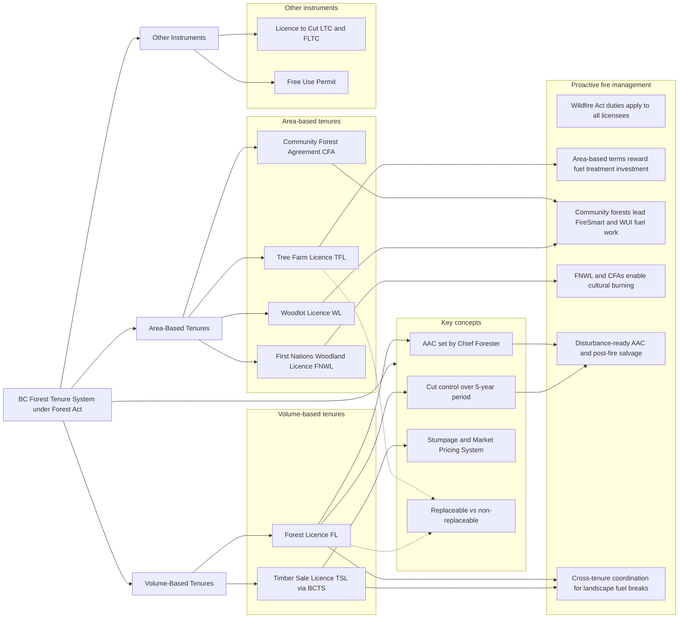

# Forest Tenure Modes in British Columbia (summary)

This handout summarizes the main **forest tenure modes** used to allocate timber harvesting rights on Crown land in BC, 
how they differ (volume-based vs. area-based, replaceable vs. non-replaceable), and why tenure design matters for **Proactive Fire Management**.

## What is a Forest Tenure?

- About **94% of BC's forest land is Crown (public) land**. The Province grants rights to harvest Crown timber through **tenures** issued under the **Forest Act**.
- A tenure defines **who** may harvest, **where**, **how much**, **for how long**, and **at what price**.
- Key dimensions of any tenure:
  - **Volume-based** (right to a share of the AAC in a Timber Supply Area) vs. **area-based** (exclusive rights within a defined area).
  - **Replaceable** (renewed at term end if obligations are met) vs. **non-replaceable** (one-time right).
  - **Term length** (from months on a Licence to Cut, up to 99 years on a Community Forest Agreement).
- All tenure holders must additionally meet on-the-ground practice rules under **FRPA** and fire prevention and hazard abatement duties under the **Wildfire Act**.
- Under **FRPA**, forest licensees must manage for **11 resource values** for which government sets objectives:
  1. Biodiversity  
  2. Cultural heritage  
  3. Fish / riparian  
  4. Forage and associated plant communities  
  5. Recreation  
  6. Resource features  
  7. Soils  
  8. Timber  
  9. Visual quality  
  10. Water quality  
  11. Wildlife

## Volume-Based Tenures

### Forest Licence (FL)

**Scope and Purpose**  
Grants the right to harvest a **specified volume per year** from a **Timber Supply Area (TSA)**. The licensee plans and develops the cutblocks within the TSA.  

**Key Components**
- **Replaceable**, long-term (typically 15–20 year terms, renewed if obligations met).  
- Largest share of the provincial AAC; held mainly by major licensees.  
- **No exclusive right** to any specific land area — multiple licensees often share a TSA.  

**Bottom Line**  
The **workhorse volume tenure** — *"how much you may cut each year, somewhere in the TSA."*

### Timber Sale Licence (TSL) and BC Timber Sales (BCTS)

**Scope and Purpose**  
Rights to harvest **specific cutblocks** developed and auctioned competitively by **BC Timber Sales**, a stand-alone government program.  

**Key Components**
- **Short-term, non-replaceable**; awarded to the highest bidder at auction.  
- BCTS builds roads and prepares the cutting authority.  
- Auction results anchor the **Market Pricing System** used to set stumpage.  

**Bottom Line**  
The **competitive tenure** — *"bid for this specific block, then hand it back."*

## Area-Based Tenures

### Tree Farm Licence (TFL)

**Scope and Purpose**  
Grants **exclusive, long-term management rights** over a defined area of Crown land, usually combined with **private land contributed by the licensee**.  

**Key Components**
- **25-year replaceable** term; sustained-yield management across the whole area.  
- Licensee prepares a management plan and inventories its own landbase.  
- Strong incentive to invest in long-term stewardship (silviculture, fuels, roads).  

**Bottom Line**  
The **industrial stewardship tenure** — *"your landbase, your responsibility, for the long run."*

### Community Forest Agreement (CFA)

**Scope and Purpose**  
Area-based tenure held by a **community organization, municipality, First Nation, or partnership**, managed for local values and benefits.  

**Key Components**
- **Long-term (25–99 years)** and replaceable.  
- Explicit mandate to manage for **multiple local values**, not just timber.  
- Frequently leads **FireSmart and wildland–urban interface fuel treatment** projects near communities.  

**Bottom Line**  
The **community tenure** — *"local control of local forests for local priorities."*

### Woodlot Licence (WL)

**Scope and Purpose**  
Small **area-based** tenure, typically **family- or individual-run**, combining Crown land with the holder's private land.  

**Key Components**
- Crown portion capped (about **800 ha on the coast / 1,200 ha in the interior**).  
- **20-year replaceable** term.  
- Hands-on, small-scale management close to home.  

**Bottom Line**  
The **small-scale tenure** — *"one family, one patch of forest, managed intensively."*

### First Nations Woodland Licence (FNWL)

**Scope and Purpose**  
**Long-term, area-based** tenure designed for **First Nations**, replacing earlier short-term non-replaceable licences.  

**Key Components**
- Terms up to **25 years**, replaceable.  
- Exclusive timber rights within a defined licence area.  
- Supports Nation-directed stewardship priorities, including **cultural burning** and ecosystem restoration.  

**Bottom Line**  
The **Indigenous stewardship tenure** — *"long-term area-based control aligned with First Nations' governance and values."*

## Other Tenure Instruments

- **Licence to Cut (LTC) / Forestry Licence to Cut (FLTC)**: short-term, non-replaceable rights to remove timber from specific small areas (e.g., road rights-of-way, utilities, salvage).  
- **Free Use Permit**: small volumes for personal or domestic use (e.g., firewood, fencing), including traditional-use harvesting by First Nations.  
- **Christmas tree permits and minor products**: small-scale harvest of non-sawlog products.  

## Key Concepts

- **Allowable Annual Cut (AAC)**: harvest level set independently by the **Chief Forester** for each TSA and TFL, reviewed at least every 10 years.  
- **Cut control**: licensees must stay within their AAC over a **5-year cut control period**, with penalties for over- or (in some cases) under-cutting.  
- **Stumpage**: the fee paid to the Crown per cubic metre harvested; appraised via the **Market Pricing System**.  
- **Replaceable vs. non-replaceable**: determines whether the tenure is a durable asset ("evergreen" renewal) or a one-time harvest right.  
- **Tenure reform trend**: policy is gradually shifting volume toward **First Nations and community tenures** and toward more **area-based** arrangements, partly to support reconciliation and landscape-level stewardship.  

## Tenure and Proactive Fire Management

- **Duties are universal**: every tenure holder has the same Wildfire Act obligations — report fires, follow high-risk activity rules, and **abate fire hazards** created by operations.  
- **Incentives differ**: long-term **area-based** tenures (TFL, CFA, WL, FNWL) reward investments in **fuel treatment and fire-resilient silviculture**, because the holder keeps the same landbase and captures the benefit.  
- **Fragmentation is the challenge**: volume-based Forest Licences share TSAs, so **landscape-scale fuel breaks** require coordination across multiple licensees, BCTS, and First Nations.  
- **Community forests and woodlots** are natural leaders for **FireSmart and WUI fuel management** near settlements.  
- **FNWLs and CFAs held by First Nations** are key vehicles for **cultural burning** and Indigenous fire stewardship on Crown land.  
- **AAC and cut control interact with fire**: salvage after wildfire, and calls for **disturbance-ready AAC** determinations that anticipate fire loss.  
- **Tenure diversification** (more area-based, more First Nations and community tenures) is increasingly framed as a **fire-resilience policy**, not just an economic one.  

## Further Resources  
- [Forest Act Full Legal Document](https://www.bclaws.gov.bc.ca/civix/document/id/complete/statreg/96157_00)
- [BC Government — Understanding FRPA (the 11 resource values)](https://www2.gov.bc.ca/gov/content/environment/natural-resource-stewardship/laws-policies-standards-guidance/legislation-regulation/forest-range-practices-act/understanding-frpa)
- [BC Government — Forest Tenures](https://www2.gov.bc.ca/gov/content/industry/forestry/forest-tenures)
- [BC Timber Sales](https://www2.gov.bc.ca/gov/content/industry/forestry/bc-timber-sales)
- [BC Community Forest Association](https://bccfa.ca/)
- [Federation of BC Woodlot Associations](https://woodlot.bc.ca/)

## Diagram: Tenure Modes and Their Links to Proactive Fire Management

The diagram below provides a visual overview of the BC forest tenure system. It groups the main tenure modes into volume-based tenures (Forest Licences and Timber Sale Licences auctioned by BC Timber Sales), area-based tenures (Tree Farm Licences, Community Forest Agreements, Woodlot Licences, and First Nations Woodland Licences), and other minor instruments, all issued under the Forest Act and governed by core concepts such as the AAC, cut control, and stumpage.

- **Volume-based tenures** grant a share of the allowable annual cut within a Timber Supply Area, without exclusive rights to any specific land.
- **Area-based tenures** grant exclusive, long-term rights over a defined landbase, creating stronger incentives for long-term stewardship investment.
- **Proactive fire management links** show how tenure design shapes fuel management incentives, FireSmart delivery, cultural burning, salvage, and landscape-scale coordination.

---

**Prepared for FRST 521 — September 2025**  
For teaching purposes only. Summarizes the tenure system under the Forest Act current to August 2025.  
